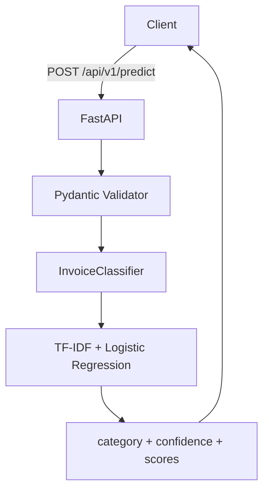

# Invoice Expense Classifier

A production-ready REST API that classifies free-text invoice descriptions into structured expense categories using a TF-IDF + Logistic Regression pipeline.

---

## Overview

Finance and ERP systems frequently receive unstructured invoice text from vendors. Manually routing these to the correct GL account or expense category is time-consuming and error-prone. This service automates that classification with a lightweight ML model that runs with zero inference cost, starts in under a second, and returns predictions with calibrated confidence scores.

**Supported Categories**

| Category | Example Invoice Text |
|---|---|
| Logistics | "Blue Dart courier charges for warehouse delivery" |
| Cloud/Software | "AWS monthly cloud hosting bill" |
| Office Supplies | "HP printer cartridges and toner refill" |
| Utilities | "BESCOM electricity bill for office premises" |
| Travel | "IndiGo flight tickets for sales team, Bangalore to Delhi" |
| Inventory | "Raw material procurement for production batch Q3" |

---

## Architecture



**Why TF-IDF + Logistic Regression?**

For short, domain-specific text with a fixed label set, this combination outperforms Naive Bayes and matches transformer-based models at a fraction of the cost. It trains in milliseconds, needs no GPU, and is fully explainable — important when the model feeds financial systems.

---

## Quickstart

### Local (Python)

```bash
# 1. Clone and install
git clone https://github.com/your-username/invoice-classifier
cd invoice-classifier
pip install -r requirements.txt

# 2. Train the model
python scripts/train.py

# 3. Start the API
uvicorn app.main:app --reload
```

API is live at `http://localhost:8000`. Interactive docs at `http://localhost:8000/docs`.

### Docker

```bash
docker build -t invoice-classifier .
docker run -p 8000:8000 invoice-classifier
```

Or with Docker Compose:

```bash
docker-compose up --build
```

---

## API Reference

### `POST /api/v1/predict`

Classify an invoice or expense description.

**Request**
```json
{
  "text": "AWS monthly cloud hosting bill"
}
```

**Response**
```json
{
  "category": "Cloud/Software",
  "confidence": 0.8741,
  "scores": {
    "Cloud/Software": 0.8741,
    "Utilities": 0.0523,
    "Office Supplies": 0.0312,
    "Logistics": 0.0214,
    "Travel": 0.0131,
    "Inventory": 0.0079
  }
}
```

**Validation Rules**
- `text` is required, must be 3–1000 characters, cannot be blank/whitespace
- Returns `422 Unprocessable Entity` if validation fails

---

### `GET /api/v1/health`

```json
{
  "status": "ok",
  "model_loaded": true,
  "version": "1.0.0"
}
```

---

### `POST /api/v1/train`

Retrain the model on updated data at `data/training_data.json`. Reloads the model in-process after training.

```json
{
  "message": "Model retrained and reloaded successfully.",
  "cv_f1_mean": 0.6795,
  "cv_f1_std": 0.0212,
  "classes": ["Cloud/Software", "Inventory", "Logistics", "Office Supplies", "Travel", "Utilities"],
  "num_samples": 75
}
```

---

## Training Data Format

`data/training_data.json` — a JSON array of labeled examples:

```json
[
  {"text": "Blue Dart courier charges for warehouse delivery", "category": "Logistics"},
  {"text": "AWS monthly cloud hosting bill", "category": "Cloud/Software"}
]
```

Add more samples to improve accuracy. Each category should have at least 10–15 diverse examples.

---

## Testing

```bash
pytest tests/ -v
```

The test suite covers preprocessing, model accuracy, API contract, schema validation, and edge cases (25 tests).

---

## Project Structure

```
invoice-classifier/
├── app/
│   ├── api/routes.py         # FastAPI route handlers
│   ├── ml/classifier.py      # TF-IDF + LR pipeline, train/predict logic
│   ├── schemas/invoice.py    # Pydantic request/response models
│   └── main.py               # App factory, lifespan, middleware
├── data/
│   └── training_data.json    # Labeled training samples
├── models/                   # Persisted model artifacts (git-ignored)
├── scripts/
│   └── train.py              # CLI training script
├── tests/
│   └── test_classifier.py    # Full test suite
├── .github/workflows/ci.yml  # GitHub Actions CI
├── Dockerfile
├── docker-compose.yml
└── requirements.txt
```

---

## Deployment

The container is self-contained — the model is trained at image build time, so startup is instant.

**Railway / Render / Fly.io (free tiers)**
```bash
# Set start command to:
uvicorn app.main:app --host 0.0.0.0 --port $PORT
```

**Environment Variables**
No required environment variables for base operation. Extend `app/main.py` to read `LOG_LEVEL`, `WORKERS`, etc. from environment as needed.

---

## Extending the Model

To add a new category (e.g., "HR & Recruitment"):

1. Add labeled examples to `data/training_data.json`
2. Retrain: `python scripts/train.py` or `POST /api/v1/train`
3. No code changes required

To swap the ML backend (e.g., to a transformer), replace the `build_pipeline()` function in `app/ml/classifier.py` while keeping the `predict()` interface intact. The API layer is fully decoupled from the model implementation.

---

## License

MIT
